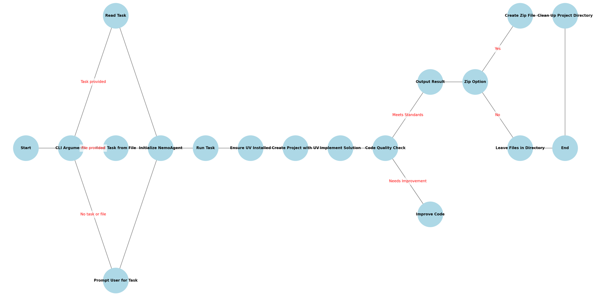
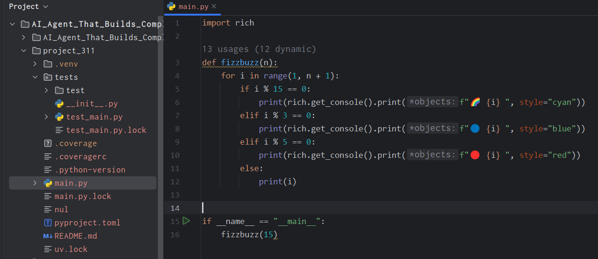

# How I Trained AI Agents


## Introduction

Full Article : [https://medium.com/@learn-simplified/how-i-trained-ai-agents-why-you-should-too-5beda74dc57c

An Agentic Local Software Developer, Think, Plan, Write Software Project, write test, run & fix test cases, ensure good test coverage, executes code, provide entire project with best practices.

Imagine a world where software writes itself, adapting and improving based on your needs. Sound like science fiction? Well, welcome to the cutting edge of AI-driven software development. In this article, we're diving into the fascinating realm of autonomous coding with our innovative CoderAIAgent. Buckle up, because the future of programming is here, and it's more exciting than you might think!

## Why Read It?

Companies that harness the power of AI are seeing dramatic improvements in efficiency, innovation, and competitiveness. This article isn't just about a cool piece of technology; it's about the future of how businesses will develop software.
By exploring CoderAIAgent, we're providing a window into how AI can transform the software development process. Imagine being able to prototype new features in a fraction of the time, or having an AI assistant that can help refactor and improve your codebase continuously. These aren't far-off possibilities - they're becoming reality.
While CoderAIAgent is a fictional company's implementation, it represents very real possibilities. This article will give you insights into:
 - How AI can speed up the software development lifecycle
 - The potential for reducing human error and improving code quality
 - Ways to free up developer time for more creative and strategic tasks
 - The implications for businesses in terms of cost savings and faster time-to-market

Whether you're a tech leader looking to stay ahead of the curve, a developer curious about the future of your profession, or a business owner interested in cutting-edge tech solutions, this article offers valuable insights into the transformative potential of AI in software development.


## Architecture





# Tutorial: Let's Build AI Agents That Build Entire Software Project For you

## Prerequisites
- Python installed on your system.
- A basic understanding of virtual environments and command-line tools.

## Steps

1. **Virtual Environment Setup:**
   - Create a dedicated virtual environment for our project:
   
     ```bash
     python -m venv AI_Agent_That_Builds_Complete_Software_Projects
     ```
   - Activate the environment:
   
     - Windows:
       ```bash
       AI_Agent_That_Builds_Complete_Software_Projects\Scripts\activate
       ```
     - Unix/macOS:
       ```bash
       source AI_Agent_That_Builds_Complete_Software_Projects/bin/activate
       ```


   
# Installation and Setup Guide

**Install Project Dependencies:**

Follow these steps to set up and run the ResearchAgents project:

1. Navigate to your project directory:
   ```
   cd path/to/your/project
   ```
   This ensures you're in the correct location for the subsequent steps.

2. Install the required dependencies:
   ```
   pip install -r requirements.txt
   ```
   This command installs all the necessary Python packages listed in the requirements.txt file.

3. Create a new crew using crewai:
   ```
   crewai create crew research_agents
   ```
   This command sets up the initial structure for your ResearchAgents crew.

4. Copy the main files from the git repository:
   - Copy `main.py` and `crew.py` from the git repo into the autogenerated `research_agents/src/research_agents` directory.
   These files contain the core functionality of the ResearchAgents project.

5. Set up the environment variables:
   - Copy the content of `.env.example` into a new `.env` file under the autogenerated `research_agents/src/research_agents` directory.
   - Add your Groq API key to the `.env` file.
   This step ensures that your API key is securely stored and accessible to the application.

6. Add the settings file:
   - Copy `settings.json` into the autogenerated `research_agents/src/research_agents` directory.
   This file contains important configuration settings for the project.

7. Navigate to the research_agents directory:
   ```
   cd research_agents
   ```
   This positions you in the correct directory for the following Poetry commands.

8. Install Poetry:
   ```
   pip install poetry
   ```
   Poetry is used for dependency management and packaging in Python.

9. Add the langchain_groq package:
   ```
   poetry add langchain_groq
   ```
   This adds the langchain_groq package to your project dependencies.

10. Update and install dependencies:
    ```
    poetry lock
    poetry install
    ```
    These commands update the lock file with the new dependency and install all project dependencies in a virtual environment.

By following these steps, you'll have a fully set up and configured ResearchAgents project ready to run. This process ensures that all necessary components are in place, including the core files, environment variables, settings, and required packages.   
     

**Install Ollama**
    
    Ollama is a powerful tool for running large language models locally on your machine. Let's walk through the installation process step-by-step.
    
    Step 1: Download Ollama
     - Visit the official Ollama website at https://ollama.com/ and click the "Download" button. The website will automatically detect your operating system and offer the appropriate installer
    
    Step 2: Install Ollama
      - For Windows and Mac users: Double-click the downloaded installer file (.exe for Windows, .dmg for Mac) and follow the on-screen instructions
      - For Linux users: Open a terminal and run the following command:

## Run - AI Agent Training

   ```bash 
      python src/main.py "create a fizzbuzz script"   
   ```


